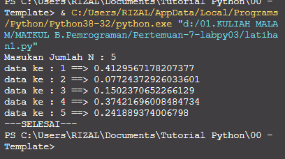
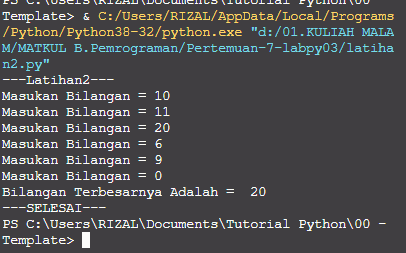
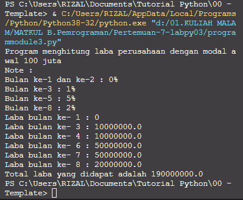

# Pertemuan-7-labpy03

Repositiry ini dibuat untuk memenuhi tugas Pertemuan 7 - Bahasa Pemrograman (Module Praktikum 3)<br><br>
Nama : Mohamad Farizal Arifin <br>
NIM : 312010231<br>
Dosen : Agung Nugroho, M.Kom<br>
Matkul : Bahasa Pemrograman<br>
Kelas : TI.20.B.1<br>

Pada halaman ini (Tugas Pertemuan-7-Module Praktikum 3) Dosen memberi tugas sebagai berikut : <br>
<br>

# Latihan1
# Algoritma
**Menampilkan n bilangan acak yang lebih kecil dari 0,5**<br><br>
**Nilai n diisi pada saat runtime.**<br>
* Memasukan/ import fungsi RANDOM terlebih dahulu<br>
* Deklarasi integer , masukkan jumlah n :<br>
* Memasukan deskripsi kombinasi for untuk menyelesaikannya.<br>
* Memasukan nilai jumlah (n) : 5<br>
* Mencetak data ke 1 sampai 5 dengan hasil nilai kurang dari 0,5.<br>
* Selesai<br><br>
Berikut source code latihan1 yang saya buat :<br>

```python
#latihan 1
print("---Latihan1---")
print ("Masukan Jumlah N : 5 ")
import random
jumlah = 5
a = 0
for x in range (jumlah):
        i = random.uniform(.0,.5)
        a+=1
        print('data ke :',a,'==>', i)
print("---SELESAI---")
```
Berikut hasil run syntax latihan1 diatas :<br>

<br>

# Latihan2
# Algoritma
**Membuat program untuk menampilkan bilangan terbesar dari n buah data yang diinputkan**<br><br>
**Masukkan angka 0 untuk berhenti**<br>
* Mulai<br>
* Mencetak "latihan 2"<br>
* Mencetak "menampilkan bilangan, berhenti ketika bilangan 0, menampilkan bilangan terbesar"<br>
* integer max = 0<br>
* Menggunakan fungsi perulangan while true, hingga menampilkan perulangan sampai batas tertentu.<br>
* Memasukan bilangan integer pada "a"<br>
* Menggunakan fungsi if jika max kurang dari nilai a, maka max sama dengan a<br>
* Mengunakan fungsi if jika nilai a adalah 0 maka fungsi break artinya perulangan berhenti jika menulis nilai 0.<br>
* Mencetak nilai paling terbesarv setelah break, sehingga menampilkan nilai terbesar diantara bilangan tersebut dalam perulangan.<br>
* Selesai<br><br>
Berikut source code latihan2 yang saya buat :<br>

```python
#latihan 2
print("---Latihan2---")
max=0
while True:
    a = int(input('Masukan Bilangan = '))
    if max < a:
        max = a
    if a==0:
        break
print("Bilangan Terbesarnya Adalah = ",max)
print("---SELESAI---")
```
Berikut hasil run syntax latihan2 diatas :<br>

<br>

# Program1
# Soal !
Membuat program sederhana dengan perulangan : Seorang pengusaha menginvestasikan uangnya untuk memulai usahanya dengan modal awal 100 juta, Pada bulan pertama dan kedua belum mendapatkan laba. Pada bulan ketiga baru mulia mendapatkan laba sebesar 1% Pada bulan ke lima pendapatan meningkat 5% Pada bulan ke delapan mengalami penurunan keuntungan sebesar 2%, sehingga laba menjadi 3%. Hitung total keuntungan selama 8 bulan berjalan usahanya.<br>
# Algoritma
Menghitung keuntungan selama 8 bulan berjalannya usaha.<br>
* Mulai<br>
* Mencetak latihan1<br>
* Mencetak "Program menghitung laba dengan modal awal 100 juta"<br>
* Membuat Note<br>
* Mencetak Bulan pertama dan kedua = 0%<br>
* Mencetak bulan ke 3 = 1%<br>
* Mencetak bulan ke 5 = 5%<br>
* Mencetak bulan ke 8 = 2%<br>
* integer a = 100.000.000( modal awal)<br>
* Menggunakan fungsi looping for pada nilai x 1-9 untuk menampilkan bulan 1 sampai bulan 8.<br>
* Menggunakan fungsi if, untuk menghitung laba bulan 1 sampai 8<br>
* bulan pertama dan kedua laba adalah 0<br>
* bulan ke 3 dan ke 4 mendapat laba 1% sehingga modal di kali 1% = keuntungan<br>
* bulan ke 5 mendapatkan laba 5%, sehingga modal dikali 5% = keuntungan<br>
* Bulan ke 8 mmendapatkan laba 2% sehingga keuntungan menurun dari bulan sebelumnya, modal dikali 2% = keuntungan.<br>
* Menghitung jumlah total laba dengan menjumlah keuntungan dari bulan ke 1 sampai bulan 8, hasilnya adalah total keuntungan yang didapat.<br>
* Selesai<br><br>
Berikut source code program1 yang saya buat :<br>

```python
#program module 3
print("Program menghitung laba perusahaan dengan modal awal 100 juta")

print("Note : ")
print("Bulan ke-1 dan ke-2 : 0%")
print("Bulan ke-3 : 1% ")
print("Bulan ke-5 : 5% ")
print("Bulan ke-8 : 2% ")

a=100000000
for x in range(1,9):
        if (x>=1 and x<2):
            b=a*0
            print("Laba bulan ke-",x,":",b)
        if (x>=3 and x<=4):
            c=a*0.1
            print("Laba bulan ke-",x,":",c)
        if (x>5 and x<=7):
            d=a*0.5
            print("Laba bulan ke-",x,":",d)
        if (x==8):
            e=a*0.2
            print("Laba bulan ke-",x,":",e)

total = b+b+c+c+d+d+d+e
print("Total laba yang didapat adalah",total)
```
Berikut hasil run syntax program1 diatas :<br>

<br>

### Demikian penjelasan dari saya mengenai Tugas Bahasa Pemrograman Pertemuan-7 Module 3 yang diperintahkan oleh Dosen, Terima kasih...