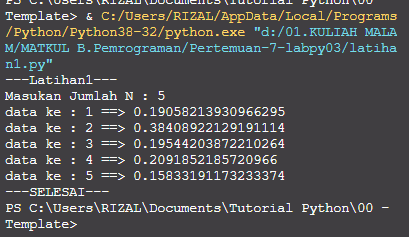

# Pertemuan-7-labpy03

Repositiry ini dibuat untuk memenuhi tugas Pertemuan 7 - Bahasa Pemrograman (Module Praktikum 3)<br><br>
Nama : Mohamad Farizal Arifin <br>
NIM : 312010231<br>
Dosen : Agung Nugroho, M.Kom<br>
Matkul : Bahasa Pemrograman<br>
Kelas : TI.20.B.1<br>

Pada halaman ini (Tugas Pertemuan-7-Module Praktikum 3) Dosen memberi tugas sebagai berikut : <br>
<br>

# Latihan1
# Algoritma
**Menampilkan n bilangan acak yang lebih kecil dari 0,5**<br><br>
**Nilai n diisi pada saat runtime.**<br>
* Memasukan/ import fungsi RANDOM terlebih dahulu<br>
* Deklarasi integer , masukkan jumlah n :<br>
* Memasukan deskripsi kombinasi for untuk menyelesaikannya.<br>
* Memasukan nilai jumlah (n) : 5<br>
* Mencetak data ke 1 sampai 5 dengan hasil nilai kurang dari 0,5.<br>
* Selesai<br>
Berikut source code yang saya buat :<br>

```python
#latihan 1
print ("Masukan Jumlah N : 5 ")
import random
jumlah = 5
a = 0
for x in range (jumlah):
        i = random.uniform(.0,.5)
        a+=1
        print('data ke :',a,'==>', i)
print("---SELESAI---")
```
Berikut hasil run syntax diatas :<br>

<br>